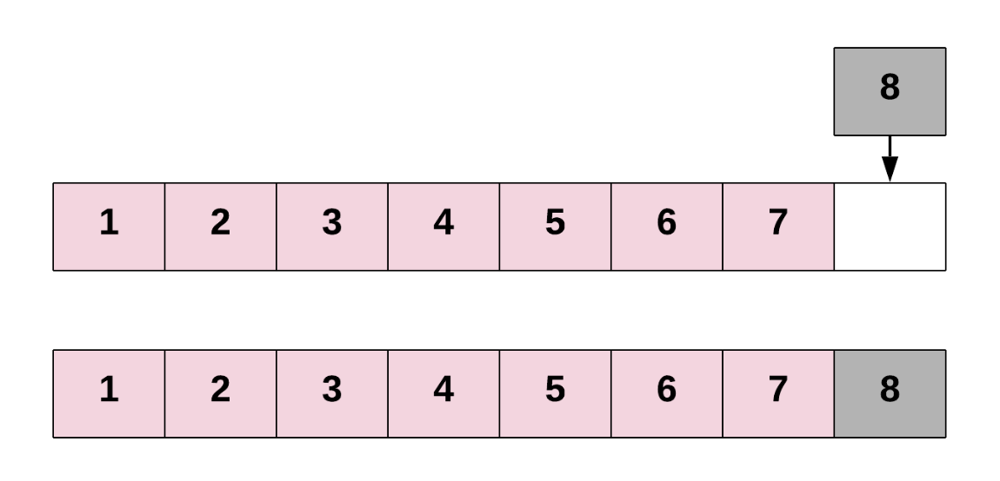
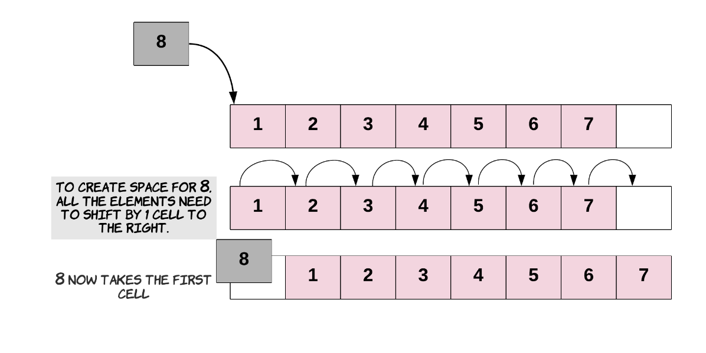
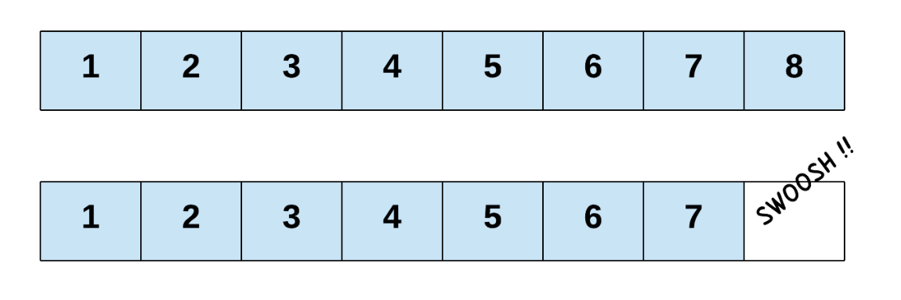
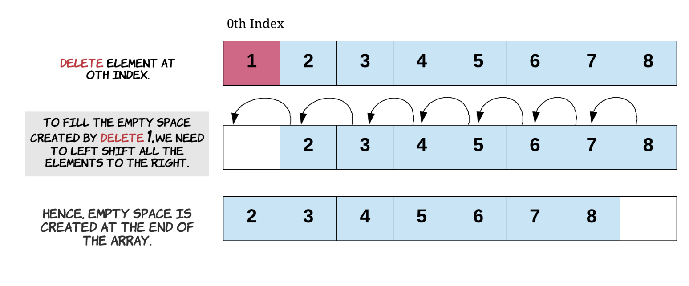
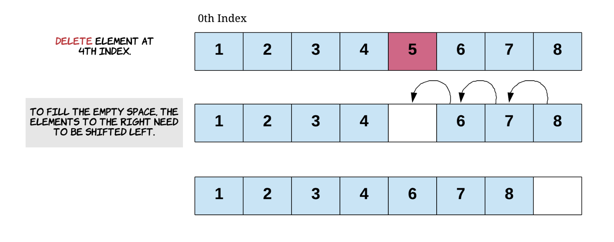
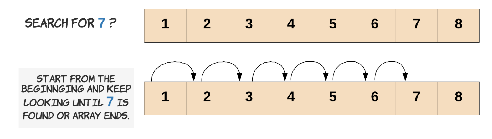

# 📍Insert

## insert at the end of array

가장 뒤에다가 추가만 하면된다. 따라서 시간 복잡도는 O(1)이 된다.



기본값 세팅하는 코드

```java
int[] intArray = new int[6];
int length = 0;

// Add 3 elements to the Array
for (int i = 0; i < 3; i++) {
    intArray[length] = i;
    length++;
}

for (int i = 0; i < intArray.length; i++) {
    System.out.println("Index " + i + " contains " + intArray[i]);
}

// Will print:

// Index 0 contains 0.
// Index 1 contains 1.
// Index 2 contains 2.
// Index 3 contains 0.
// Index 4 contains 0.
// Index 5 contains 0.
```

index가 4인곳에 값을 추가하자

```java
// Insert a new element at the end of the Array. Again,
// it's important to ensure that there is enough space
// in the array for inserting a new element.
intArray[length] = 10;
length++;

// Index 0 contains 0.
// Index 1 contains 1.
// Index 2 contains 2.
// Index 3 contains 10. 추가된 부분
// Index 4 contains 0.
// Index 5 contains 0.
```

## insert at the beginning of array

상식적으로 가장 앞에 넣으면 모두 뒤로 이동시켜야 하니까 시간복잡도는 O(n)이 된다.



```java
// 먼저 전부 뒤로 이동시킨다
for (int i = 3; i >= 0; i--) {
    intArray[i + 1] = intArray[i];
}

intArray[0] = 20; // 빈 공간에 새로운 값을 추가한다

// Will print:

// Index 0 contains 20.
// Index 1 contains 0.
// Index 2 contains 1.
// Index 3 contains 2.
// Index 4 contains 10.
// Index 5 contains 0.
```

## insert at the middle of array

추가되는 인덱스부터 뒤로 모조리 이동시킨다. 이 경우 K만큼 이동시키기 때문에 K = N 이여서 시간복잡도는 O(n)이 된다. 단 가장 앞에 원소를 추가한 것보다는 시간복잡도는 빠르게 된다.


```java
for (int i = 4; i >= 2; i--) {
    intArray[i + 1] = intArray[i];
}

intArray[2] = 30; // 빈 공간에 새로운 값을 넣는다.

// Will print:

// Index 0 contains 20.
// Index 1 contains 0.
// Index 2 contains 30.
// Index 3 contains 1.
// Index 4 contains 2.
// Index 5 contains 10.
```

# 📍Delete

## delete at the end of array

`queue`랑 비슷하다. 가장 뒤에 원소만 제거하면 된다. 따라서 시간 복잡도는 O(1)이 된다.



```java
int[] intArray = new int[10];

int length = 0;

for(int i = 0; i < 6; i++) {
    intArray[length] = i;
    length++;
}

// Deletion from the end is as simple as reducing the length
// of the array by 1.
length--;

for (int i = 0; i < intArray.length; i++) {
    System.out.println("Index " + i + " contains " + intArray[i]);
}

// Will print:

// Index 0 contains 0.
// Index 1 contains 1.
// Index 2 contains 2.
// Index 3 contains 3.
// Index 4 contains 4.
// Index 5 contains 5.
// Index 6 contains 0.
// Index 7 contains 0.
// Index 8 contains 0.
// Index 9 contains 0.
```

`intArray.length`때문에 배열의 용량크기가 나온다. 배열의 모든 값이 이렇게 나오는 것이 아닌, 배열내부에 원소값의 크기만큼 나오도록 만들자. 즉, 원소가 있는 값만 나오게 하는것 이다.

따라서 `length 변수`를 이용하자.

```java
for (int i = 0; i < length; i++) {
    System.out.println("Index " + i + " contains " + intArray[i]);
}

// 삭제한뒤의 모습
// Index 0 contains 0.
// Index 1 contains 1.
// Index 2 contains 2.
// Index 3 contains 3.
// Index 4 contains 4.
```

## delete at the beginning of array

상식적으로 생각해보자. 가장 앞 원소를 삭제하면 뒤에 있는 모든 원소는 1칸 당겨와야한다. 따라서 시간복잡도는 O(n)이 된다.



```java
// Starting at index 1, we shift each element one position
// to the left.
for (int i = 1; i < length; i++) {
    // Shift each element one position to the left
    int_array[i - 1] = int_array[i];
}

// Note that it's important to reduce the length of the array by 1.
// Otherwise, we'll lose consistency of the size. This length
// variable is the only thing controlling where new elements might
// get added.
length--;

// Index 0 contains 1.
// Index 1 contains 2.
// Index 2 contains 3.
// Index 3 contains 4.
```

## delete at the middle of array

시작하는 인덱스 부터 뒤로 앞으로 당겨와야한다. 따라서 K만큼 소모가 된다. K = N이기 때문에 시간복잡도는 O(n)이 된다.



```java
// Say we want to delete the element at index 1
for (int i = 2; i < length; i++) {
    // Shift each element one position to the left
    int_array[i - 1] = int_array[i];
}

// Again, the length needs to be consistent with the current
// state of the array.
length--;

// Index 0 contains 1.
// Index 1 contains 3.
// Index 2 contains 4.
```

# 📍Search

## linear search

리니어 서치의 경우 시간복잡도는 O(n)을 가지게 된다. 왜냐하면 찾고자 하는 원소가 가장 뒤에 있는 경우 전체 탐색을 해야하기 때문이다. 반대로 가장 앞에 위치한 경우 시간복잡도는 O(1)이 된다.



```java
public static boolean linearSearch(int[] array, int length, int element) {
    // 유효성 검사를 한다.
    if (array == null || length == 0) {
        return false;
    }

    // Carry out the linear search by checking each element,
    // starting from the first one.
    for (int i = 0; i < length; i++) {
        // We found the element at index i.
        // So we return true to say it exists.
        if (array[i] == element) {
            return true;
        }
    }

    // We didn't find the element in the array.
    return false;
}
```

```java
public class ArraySearch {
    public static void main(String args[]) {

        // Declare a new array of 6 elements
        int[] array = new int[6];

        // Variable to keep track of the length of the array
        int length = 0;

        // Iterate through the 6 indexes of the Array.
        for (int i = 0; i < 6; i++) {
            // Add a new element and increment the length as well
            array[length++] = i;
        }

        // Print out the results of searching for 4 and 30.
        System.out.println("Does the array contain the element 4? - " + ArraySearch.linearSearch(array, length, 4));
        System.out.println("Does the array contain the element 30? - " + ArraySearch.linearSearch(array, length, 30));

        // Does the array contain the element 4? - true
        // Does the array contain the element 30? - false
    }

    public static boolean linearSearch(int[] array, int length, int element) {
        // Check for edge cases
        if (array == null || length == 0) {
            return false;
        }

        // Check each element starting from the first one
        for (int i = 0; i < length; i++) {
            // We found the element at index i, so return true.
            if (array[i] == element) {
                return true;
            }
        }

        // We didn't find the element in the array.
        return false;
    }
}
```

## binary search

[binary search card](https://leetcode.com/explore/learn/card/binary-search/) 에서 담당