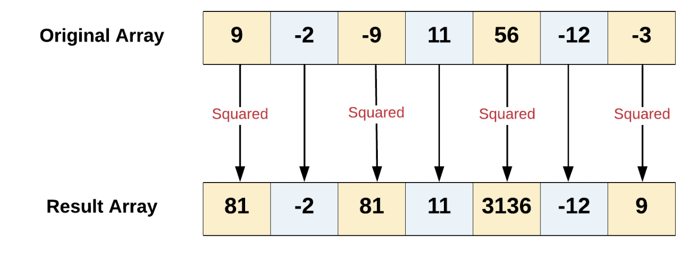
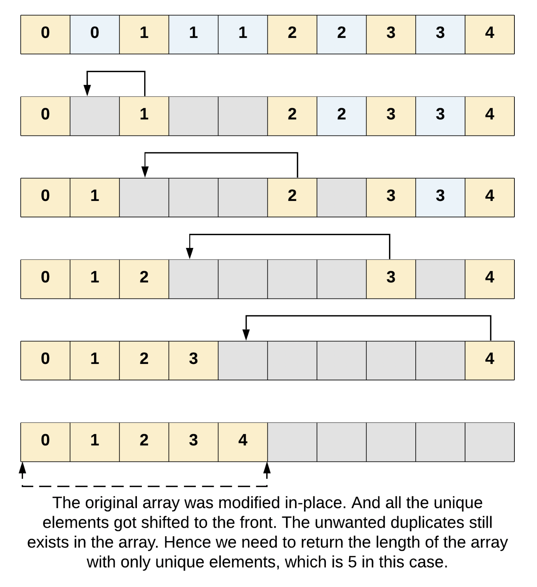
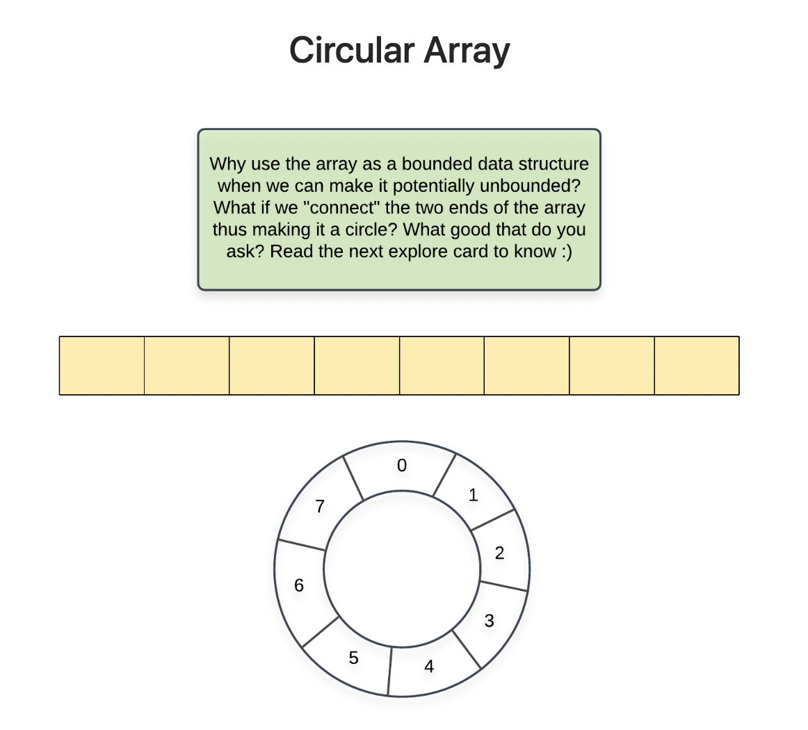
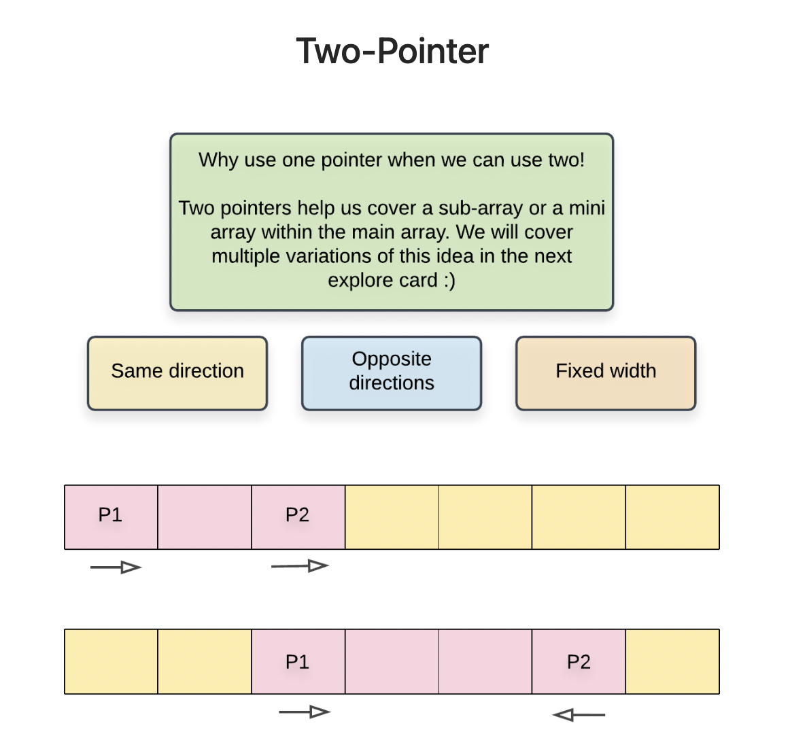

# 📍In-place

```
Input: array = [9, -2, -9, 11, 56, -12, -3]
Output: [81, -2, 81, 11, 3136, -12, 9]
Explanation: The numbers at even indexes (0, 2, 4, 6) have been squared, 
whereas the numbers at odd indexes (1, 3, 5) have been left the same.
```

이 문제를 푸는 방법은 2가지 방법이 있다. 첫번째는 새로운 배열을 만들어서 문제를 해결하는 방식과 기존 배열에 넣는 것이다.


## new array

```java
public int[] squareEven(int[] array, int length) {

  if (array == null) {
    return null;
  }

  int result[] = new int[length];

  for (int i = 0; i < length; i++) {

    int element = array[i];

    if (i % 2 == 0) {
      element *= element;
    }

    // Write element into the result Array.
    result[i] = element;
  }

  // Return the result Array.
  return result;
}
```



공간 복잡도는 `O(n)`이 된다.

하지만 우리는 new array를 사용하지 않고 기존 배열을 이용할 예정, 이것을 `in-place`라고 한다.

## in-place

```java
public int[] squareEven(int[] array, int length) {

  if (array == null) {
    return array;
  }

  for (int i = 0; i < length; i += 2) {
    array[i] *= array[i];
  }

  return array;
}
```

기존에 있던 배열을 사용했다. 따라서 공간복잡도는 `O(1)`이 나오게 된다.

# 📍Two pointer technique

- question

```
Input: array = [0, 0, 1, 1, 1, 2, 2, 3, 3, 4]
Output: [0, 1, 2, 3, 4]

Input: array = [1, 1, 2]
Output: [1, 2]
```

- first answer

```java
class Solution {
    public int removeDuplicates(int[] nums) {
        
        // The initial length is simply the capacity.
        int length = nums.length;
        
        // Assume the last element is always unique.
        // Then for each element, delete it if it is
        // the same as the one after it. Use our deletion
        // algorithm for deleting from any index.
        for (int i = length - 2; i >= 0; i--) {
            if (nums[i] == nums[i + 1]) {
                // Delete the element at index i, using our standard
                // deletion algorithm we learned.
                for (int j = i + 1; j < length; j++) {
                    nums[j - 1] = nums[j];
                }
                // Reduce the length by 1.
                length--;
            }
        }
        // Return the new length.
        return length;
    }
}
```

공간복잡도는 O(1) 시간복잡도는 O(N^2)

```java
public int[] copyWithRemovedDuplicates(int[] nums) {
        
  if (nums == null || nums.length == 0) {
      return nums;
  }

  int uniqueNumbers = 0;
  for (int i = 0; i < nums.length; i++) {
      // An element should be counted as unique if it's the first
      // element in the Array, or is different to the one before it.
      if (i == 0 || nums[i] != nums[i - 1]) {
          uniqueNumbers++;
      }
  }

  // Create a result Array.
  int[] result = new int[uniqueNumbers];

  // Write the unique elements into the result Array.
  int positionInResult = 0;
  for (int i = 0; i < nums.length; i++) {
    // Same condition as in the previous loop. Except this time, we can write
    // each unique number into the result Array instead of just counting them.
      if (i == 0 || nums[i] != nums[i - 1]) {
          result[positionInResult] = nums[i];
          positionInResult++;
      }
  }
  return result;
}
```

공간복잡도는 O(1) 시간복잡도는 O(N)

- second answer

지금 방법은 two-pointer 방법을 사용. 필요한 것은 `readPointer`와 `writePointer`

```java
public int removeDuplicates(int[] nums) {
        
  if (nums == null) {
      return 0;
  }
  
  // Use the two pointer technique to remove the duplicates in-place.
  // The first element shouldn't be touched; it's already in its correct place.
  int writePointer = 1;

  // Go through each element in the Array.
  for (int readPointer = 1; readPointer < nums.length; readPointer++) {
      if (nums[readPointer] != nums[readPointer - 1]) {
          nums[writePointer] = nums[readPointer];
          writePointer++;
      }
  }

  return writePointer;
}
```

공간복잡도 O(1) 시간복잡도 O(N^2)



## when use in-place array operation

시간복잡도가 O(1)이 되기 때문에 사용 추천, `하지만 기존의 배열이 필요한 경우는 추천 X`


# 📍Array



