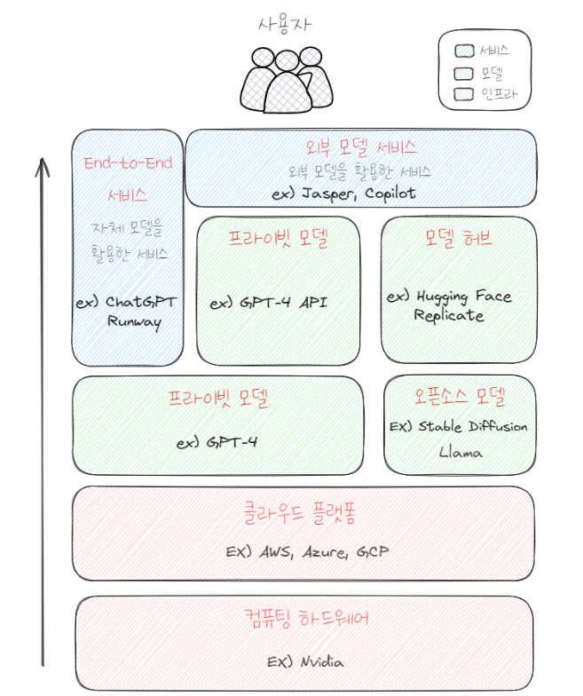
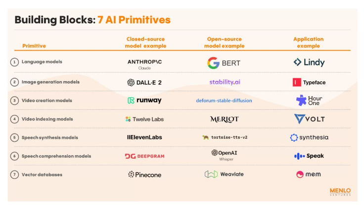

출처: [링크](https://yozm.wishket.com/magazine/detail/2497/)

생성 AI 산업의 밸류체인(Value Chain)

# 인프라, 모델, 서비스

- 생성 AI 비즈니스는 인프라, 모델, 서비스 축을 중심으로 확장

인프라: 생성AI는 모델 학습과 서비스 운영에 많은 프로세스 가용. 워크로드를 처리하는데 반도체, 서버 등 고사양의 인프라가 중요한 역할.

모델: 생성 AI 서비스에 핵심요소. ChatGPT에 GPT-4 모델을 적용한 것.

서비스: 생성 AI를 활용할 수 있도록 엔드 유저(End user)에게 제공되는 제품. 예시로는 Adobe Firefly, Claude

# 소수에게 집중되는 인프라

생성 AI 핵심은 지식을 학습 후 지식을 기반으로 새로운 정보를 생성하는 것. 이 과정에서 많은 데이터 처리가 필요. GPT-3의 경우 45테라 바이트의 텍스트 데이터를 학습함.

따라서 방대한 데이터 처리와 운영 최적화를 위해 인프라가 매우매우 중요.

- 반도체: 고사양 GPU가 핵심, 따라서 엔비디아가 급 부상. 고사양 반도체라는 하드웨어 없이 생성 AI 운영은 불가능.
- 클라우드 플랫폼: 고사양 반도체의 배포에서 필수. 생성 AI에 뛰어든 모든 기업이 GPU가 탑재된 서버를 필요로 하지만, 비용 문제로 어려워함. 따라서 AWS 등 대형 클라우드 서비스를 통해 고사양 서버를 활용. 필수 하드웨어를 쉽게 활용할 수 있게 만들어주기 때문에, 소수 대형 클라우드 플랫폼의 지배력은 강화.

# 두뇌 모델

- 오픈소스 모델: 누구에게나 공개, 오픈소스의 확장에 따라 모델 허브도 같이 성장. 모델 허브는 많은 오픈 소스 모델을 쉽게 발견하고 활용할 수 있도록 지원하는 플랫폼역할. 허깅 페이스가 대표적인 모델 허브 서비스.
- 프라이빗 모델: 접근 권한을 가진 사용자만 활용. 대부분 유료. 구매하면 API로 제공. 오픈AI의 Sora, GPT-4 모두 프라이빗 모델.

# 서비스

- 엔드유저는 채팅이라는 인테퍼이스를 통해 에세이 초안 작성을 요청.
- 현재는 엔드 투 엔드, 외부 모델 서비스라는 형태로 성장. 엔드 투 엔드 서비스는 자체 개발한 모델이 적용된 서비스. 즉, 모델부터 서비스 출시까지 전체 과정을 내재화한 회사들이 제공하는 서비스.
- 외부 모델 서비스는 다른 회사의 모델이 적용된 서비스. MS의 Copilot은 오픈 AI가 개발한 모델을 활용. 프라이빗 모델을 API형태로 제공받아 사용.
- 외부 모델 서비스는 2개 이상의 외부 모델을 사용하는 경우도 있음. 자체 개발한 프라이빗 모델과 조합하여 사용하는 경우도 있음.

# 앞으로의 발전

- 기존 이용 환경에 통합
- 서비스의 타킷이 분명하고 차별되는 정보를 생성(맞춤화)