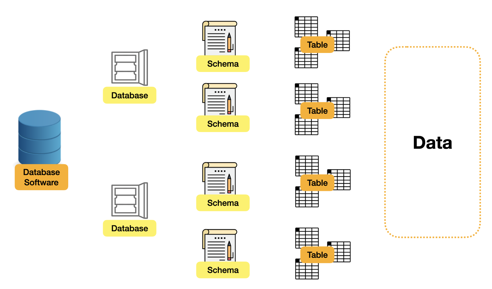
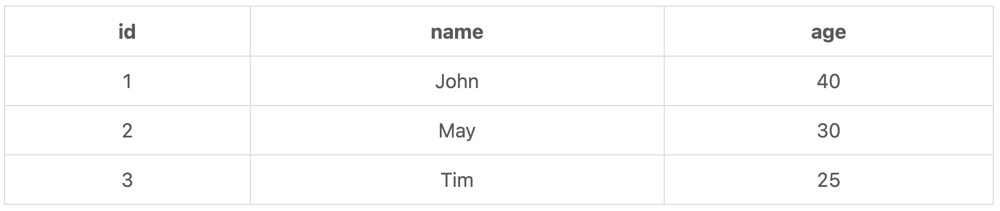
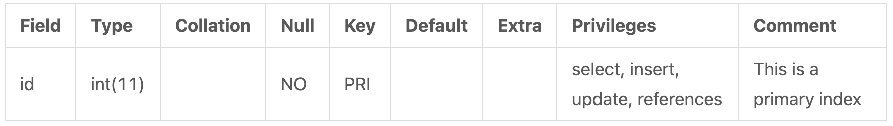

# 📍Schema

## general database structure



1. `Database Software`:  MySQL, PostgreSQL, MsSQL과 같은 것
2. `Database`: Database Software를 각기 다른 Database로 나눈 것
- 예를 들면, 미국 주식과 영국 주식은 다른 데이터베이스를 가지는 것
3. `Schema`: Table들의 집합, 논리적으로 합치거나 분리한 것
- 어떤 곳에서는 Datebase와 Schema를 합쳐서 사용
4. `Table`: Database의 key section, 각 record는 다른 데이터를 의미하고 데이터의 사이즈, 타입, 디폴트 값들을 책임지는 곳
5. `Data`: 테이블을 구성하는 한 요소

## schema syntax

### basic sql syntax

- create schema

```sql
create schema `new_schema` default character set utf8mb4 COLLATE utf8mb4_unicode_ci;
```

- check all schema in MySQL

```sql
SELECT * FROM INFORMATION_SCHEMA.SCHEMATA; // MySQL에 저장되어있는 모든 스키마 불러오기
```

# 📍Table

## sql syntax

### create table

```sql
CREATE SCHEMA `new_schema` DEFAULT CHARACTER SET utf8mb4 COLLATE utf8mb4_unicode_ci;

CREATE TABLE `new_schema`.`new_table` (
  `id` INT NOT NULL COMMENT 'This is a primary index',
  PRIMARY KEY (`id`) // 선언 필요
);
```



### read table

```sql
SHOW FULL COLUMNS FROM `new_schema`.`new_table`;
```



### destroy table

```sql
DROP TABLE `new_schema`.`new_table`;
```

### clean table

```sql
TRUNCATE `new_schema`.`new_table`;
```

# 📍Column


## data types

기본적인 타입 number, datatime, text -> extension

### number

- bigint, int, mediumint, smallint, tinyint: 왼쪽으로 갈 수록 큰 숫자가 저장이 가능, `int`의 경우 `-2147483648` ~ `2147483647`
- double, float, decimal: double이나 float의 경우 2.5는 2.500000002로 되어있기 때문에, 정확하지 않다. 따라서 `decimal` 사용 추천.

### datetime

- date, month, year
- datetime, timestamp: datetime은 `8888-01-01 00:00:00`까지 가능하고, timestamp는 `1970-01-01 00:00:01` ~ `2038-01-19 03:14:07`까지 가능하다.

### text

- char, varchar: MySQL에서 varchar의 경우 디폴트 사이즈는 `varchar(45)`
- text, longtext: 알 수 없는 데이터의 길이인 경우 text를 사용

### special data type

- binary, blob: 이미지 또는 비디오 같은 데이터를 저장할 때 사용, 하지만 관리가 어려워서 사용하지 않는다.
- boolean: 1(true) or 0(false)
- json: json형태로 데이터를 저장하는 것

## column attribute functions

```sql
CREATE SCHEMA `new_schema` DEFAULT CHARACTER SET utf8mb4 COLLATE utf8mb4_unicode_ci;

CREATE TABLE `new_schema`.`users` (
  `id` INT NOT NULL AUTO_INCREMENT COMMENT 'This is the primary index',
  `name` VARCHAR(45) NOT NULL DEFAULT 'N/A',
  PRIMARY KEY (`id`)
);
```

- NOT NULL
- AUTO_INCREMENT
- DEFAULT

## create and update column

- 예시

```sql
ALTER TABLE `new_schema`.`users`
ADD COLUMN `age` INT NULL AFTER `name`;

ALTER TABLE `new_schema`.`users`
CHANGE COLUMN `id` `id` INT(11) NOT NULL AUTO_INCREMENT,
CHANGE COLUMN `name` `user_name` VARCHAR(45) NOT NULL DEFAULT 'No Name';

SHOW FULL COLUMNS FROM `new_schema`.`users`;
```

### create

```sql
ALTER TABLE `new_schema`.`users` ADD COLUMN `age` INT NULL AFTER `name`;
```

### update

```sql
ALTER TABLE `new_schema`.`users`
CHANGE COLUMN `id` `id` INT(11) NOT NULL AUTO_INCREMENT,
CHANGE COLUMN `name` `user_name` VARCHAR(45) NOT NULL DEFAULT 'No Name';
```