# 📍Select, Insert, Update and Delete

## basic syntax

```sql
SELECT `id`, `name` FROM `new_schema`.`users`;
```

sample data

```sql
CREATE SCHEMA `new_schema` DEFAULT CHARACTER SET utf8mb4 COLLATE utf8mb4_unicode_ci;

CREATE TABLE `new_schema`.`users` (
  `id` INT NOT NULL AUTO_INCREMENT COMMENT 'This is the primary index',
  `name` VARCHAR(45) NOT NULL DEFAULT 'N/A',
  `age` INT NULL,
  `height` INT NULL,
  PRIMARY KEY (`id`)
);

INSERT INTO `new_schema`.`users` (`id`, `name`, `age`, `height`) VALUES (1, 'John', 50, 180);
INSERT INTO `new_schema`.`users` (`id`, `name`, `age`) VALUES (2, 'May', 40);
INSERT INTO `new_schema`.`users` (`id`, `name`, `age`, `height`) VALUES (3, 'Tim', 10, 170);
INSERT INTO `new_schema`.`users` (`id`, `name`, `age`, `height`) VALUES (4, 'Jay', 20, 155);
```

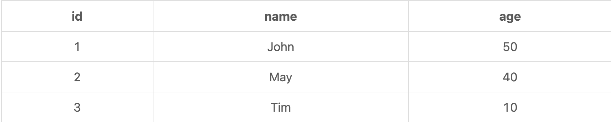

## create: insert

```sql
INSERT INTO `new_schema`.`users` (`id`, `name`, `age`) VALUES (4, 'Harry', 33);
```

- multi create

```sql
INSERT INTO `new_schema`.`users` (`id`, `name`, `age`) VALUES (4, 'Harry', 33), (5, 'Tom', 30);
```

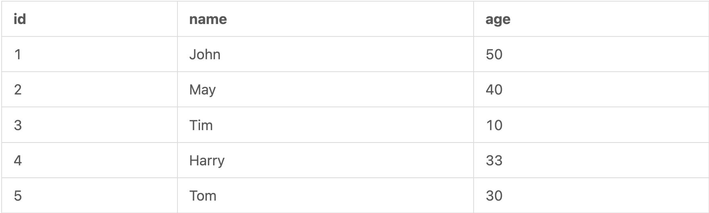

## read: select

```sql
SELECT `id`, `name` FROM `new_schema`.`users`;
```

- 전체 조회

```sql
SELECT * FROM `new_schema`.`users`;
```

### condition

```sql
SELECT * FROM `new_schema`.`users` WHERE `id` = 2;
```

## modify: update

```sql
UPDATE `new_schema`.`users` SET `name` = 'Andy', `age` = 100 WHERE `id` = 2;
```

where절이 존재하지 않으면, 전체를 수정한다.

## remove: delete

```sql
DELETE FROM `new_schema`.`users` WHERE `id` = 1;
```

# 📍Where

## basic condition

### equal to, greater than, and less than

```sql
SELECT * FROM `new_schema`.`users` WHERE id = 1;
SELECT * FROM `new_schema`.`users` WHERE id > 2;
SELECT * FROM `new_schema`.`users` WHERE id <= 1;
SELECT * FROM `new_schema`.`users` WHERE id != 1;
```

### null

```sql
SELECT * FROM `new_schema`.`users` WHERE height IS NULL;
SELECT * FROM `new_schema`.`users` WHERE height IS NOT NULL;
```

## mutiple condition

### and

```sql
SELECT * FROM `new_schema`.`users` WHERE age < 40 AND height > 160;
```

### or

```sql
SELECT * FROM `new_schema`.`users` WHERE age < 40 OR height > 160;
```

### and + or

```sql
SELECT * FROM `new_schema`.`users` WHERE id < 4 AND (age > 30 OR height > 175);
```

## range condition

### in

```sql
SELECT * FROM `new_schema`.`users` WHERE `id` IN (1, 3);
SELECT * FROM `new_schema`.`users` WHERE id NOT IN (1, 4);
```

### between

```sql
SELECT * FROM `new_schema`.`users` WHERE height BETWEEN 160 AND 190;
```

### like

```sql
SELECT * FROM `new_schema`.`users` WHERE name LIKE '%a%'; // 중간에 a가 들어가는 것
SELECT * FROM `new_schema`.`users` WHERE name LIKE 'J%'; // 시작이 J로 시작하는 것
SELECT * FROM `new_schema`.`users` WHERE name LIKE '%y'; // 끝이 y로 끝나는 것
```

# 📍Json in SQL

```sql
ALTER TABLE `new_schema`.`users` ADD COLUMN `contact` JSON NULL AFTER `id`;
```

sample data

```sql
CREATE SCHEMA `new_schema` DEFAULT CHARACTER SET utf8mb4 COLLATE utf8mb4_unicode_ci;

CREATE TABLE `new_schema`.`users` (
  `id` INT NOT NULL AUTO_INCREMENT COMMENT 'This is the primary index',
  `name` VARCHAR(45) NOT NULL DEFAULT 'N/A',
  PRIMARY KEY (`id`)
);

ALTER TABLE `new_schema`.`users` ADD COLUMN `contact` JSON NULL AFTER `id`;

INSERT INTO `new_schema`.`users` (`id`, `name`, `contact`) VALUES 
  (1, 'John', JSON_OBJECT('phone', '123-456', 'address', 'New York')),
  (2, 'May', JSON_OBJECT('phone', '888-99', 'address', 'LA')),
  (3, 'Tim', JSON_OBJECT('phone', '1236')),
  (4, 'Jay', JSON_OBJECT('phone', '321-6', 'address', 'Boston'));
```

## json

[json](https://developer.mozilla.org/en-US/docs/Learn/JavaScript/Objects/JSON)

- Json 형식

```json
{
    "orderId": 54321,
    "info": [
        {
            "productID": 34,
            "productName": "productOne",
            "quantity": 1
        },
        {
            "productID": 56,
            "productName": "productTwo",
            "quantity": 3
        },
    ],
    "orderCompleted": true
}
```

## read json data

- 따옴표 있음
```sql
SELECT `id`, JSON_EXTRACT(contact, '$.phone') AS phone
FROM `new_schema`.`users`;
```

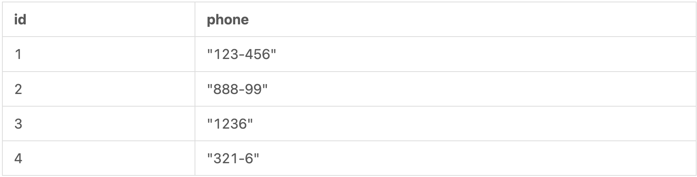

- 따옴표 없음

```sql
SELECT `id`, JSON_UNQUOTE(JSON_EXTRACT(contact, '$.phone')) AS phone
FROM `new_schema`.`users`;
```

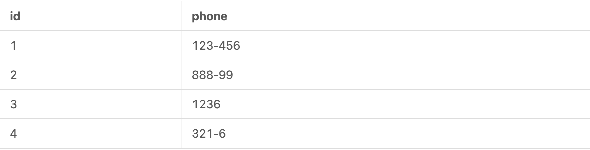

- json 데이터에서 456을 포함한 데이터를 찾고 싶을 때

```sql
SELECT `id`, JSON_UNQUOTE(JSON_EXTRACT(contact, '$.phone')) AS phone
FROM `new_schema`.`users`
WHERE JSON_EXTRACT(contact, '$.phone') like '%456%';
```

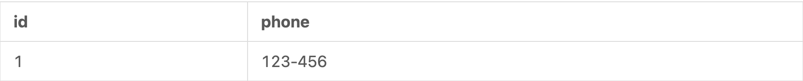

## add json data

```sql
INSERT INTO `new_schema`.`users` (`id`, `name`, `contact`) VALUES (5, 'Harry', JSON_OBJECT('phone', '1231123', 'address', 'Miami'));
```

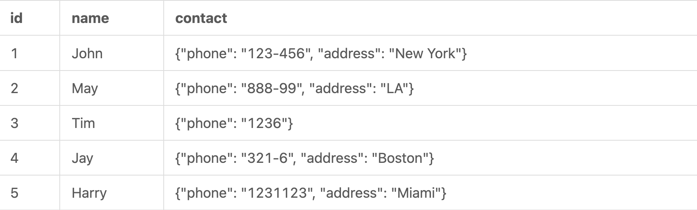

## update json data

```sql
UPDATE `new_schema`.`users` SET `contact` = JSON_SET(contact, '$.phone', '6666', '$.phone_2', '888') WHERE `id` = 2;
```

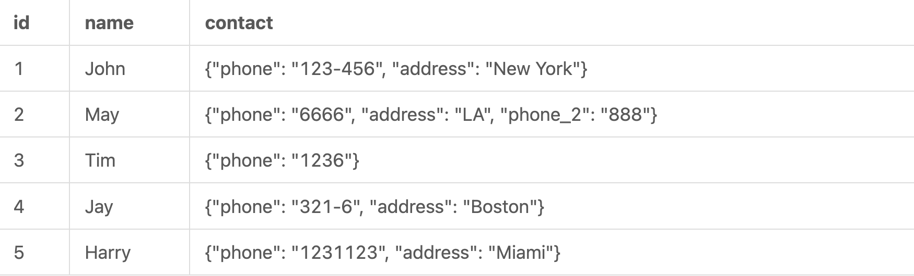

# 📍Auxiliary select Statements

sample data

```sql
CREATE SCHEMA `new_schema` DEFAULT CHARACTER SET utf8mb4 COLLATE utf8mb4_unicode_ci;

CREATE TABLE `new_schema`.`users` (
  `id` INT NOT NULL AUTO_INCREMENT COMMENT 'This is the primary index',
  `name` VARCHAR(45) NOT NULL DEFAULT 'N/A',
  `age` INT NULL,
  `height` INT NULL,
  PRIMARY KEY (`id`)
);

INSERT INTO `new_schema`.`users` (`id`, `name`, `age`, `height`) VALUES 
  (1, 'John', 40, 150),
  (2, 'May', 30, 140),
  (3, 'Tim', 25, 170),
  (4, 'Jay', 60, 185),
  (5, 'Maria', 30, 190),
  (6, 'Tom', 53, 200),
  (7, 'Carter', 40, 145);
```

## uniqueness: distinct

```sql
SELECT DISTINCT age FROM `new_schema`.`users`;
```

## pagination: limit & offset

```sql
SELECT * FROM `new_schema`.`users` LIMIT 3 OFFSET 1;
```

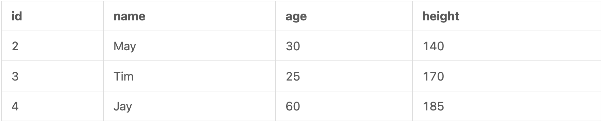

```sql
SELECT * FROM `new_schema`.`users` LIMIT 3 OFFSET 0;
SELECT * FROM `new_schema`.`users` LIMIT 3 OFFSET 3;
SELECT * FROM `new_schema`.`users` LIMIT 3 OFFSET 6;
```

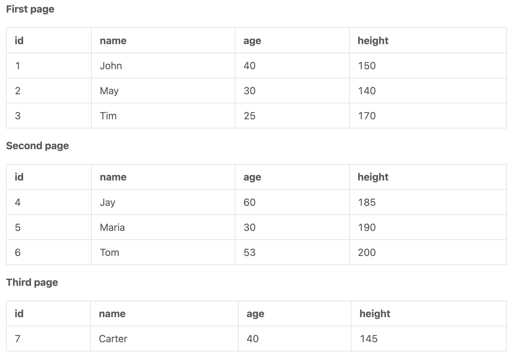

## sorting: order

```sql
SELECT * FROM `new_schema`.`users` ORDER BY age;
SELECT * FROM `new_schema`.`users` ORDER BY age ASC;
SELECT * FROM `new_schema`.`users` ORDER BY age DESC;
```

- multi column sorting

```sql
SELECT * FROM `new_schema`.`users` ORDER BY age DESC, height DESC;
```

## grouping: group by

distinct와 같아 보이지만 group by는 Aggregate function를 도와준다.

```sql
SELECT `age` FROM `new_schema`.`users` GROUP BY age; // distinct와 동일한 결과를 가져왔음
```

- 질문: how many records there are in each age group

```sql
SELECT COUNT(*), `age` FROM `new_schema`.`users` GROUP BY age;
```

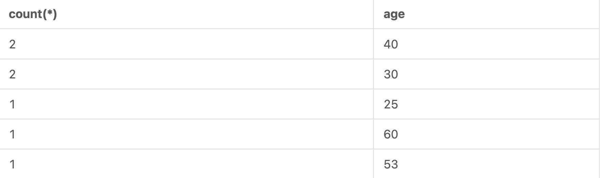

```sql
SELECT COUNT(*) AS `age_count`, `age`
FROM `new_schema`.`users`
GROUP BY age
ORDER BY `age_count`;
```

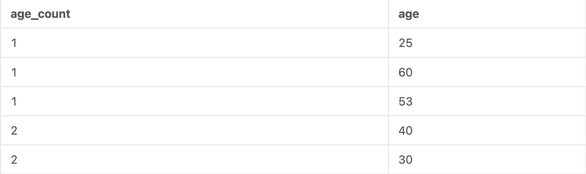

# 📍Aggregate function

sample data

```sql
CREATE SCHEMA `new_schema` DEFAULT CHARACTER SET utf8mb4 COLLATE utf8mb4_unicode_ci;

CREATE TABLE `new_schema`.`users` (
  `id` INT NOT NULL AUTO_INCREMENT COMMENT 'This is the primary index',
  `name` VARCHAR(45) NOT NULL DEFAULT 'N/A',
  `age` INT NULL,
  `height` INT NULL,
  PRIMARY KEY (`id`)
);

INSERT INTO `new_schema`.`users` (`id`, `name`, `age`, `height`) VALUES 
  (1, 'John', 40, 150),
  (2, 'May', 30, 140),
  (3, 'Tim', 25, 180),
  (4, 'Jay', 40, 160);
```

## count

```sql
SELECT COUNT(*) AS `user_count` FROM `new_schema`.`users` WHERE id > 1;
```

## sum

```sql
SELECT SUM(`age`) AS `sum_of_user_ages` FROM `new_schema`.`users`;
```

## avg

```sql
SELECT AVG(`height`) AS `avg_user_height` FROM `new_schema`.`users`;
```

## min, max

```sql
SELECT MIN(`height`) AS `user_min` FROM `new_schema`.`users`;
SELECT MAX(`height`) AS `user_max` FROM `new_schema`.`users`;
```

## other functions

### concat()

concat은 단어를 조합하는 것. 밑에 보면 id랑 name을 조합하는 것임.

```sql
SELECT CONCAT(`id`, '-', `name`) AS `identification`, `age` FROM `new_schema`.`users`;
```

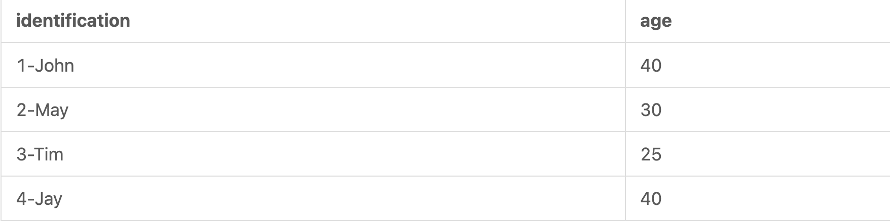

하지만 concat을 사용해서 만든 column은 where `%J%` 같은 기능을 하지 못한다.

`왜냐하면 where절은 이미 table에 존재하는 column만 가능하기 때문이다. 따라서 조합을 통해서 만들어진 identification에는 where절을 사용할 수 없다.`

하지만 다른 방법으로 찾는 방법이 가능하다. 바로 `having`을 이용하는 것이다.

```sql
SELECT CONCAT(`id`, '-', `name`) AS `identification`, `age` FROM `new_schema`.`users`
HAVING `identification` LIKE '%J%';
```

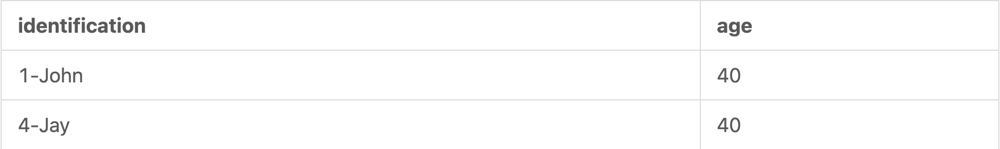

`where와 having은 비슷한 기능을 한다. 하지만 having을 사용하면 성능이 떨어진다. 따라서 where를 사용하는 것이 좋다.`