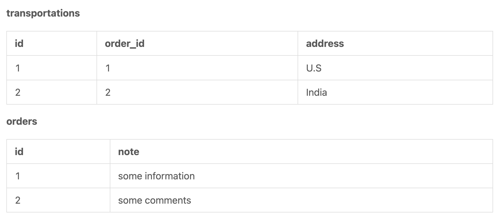
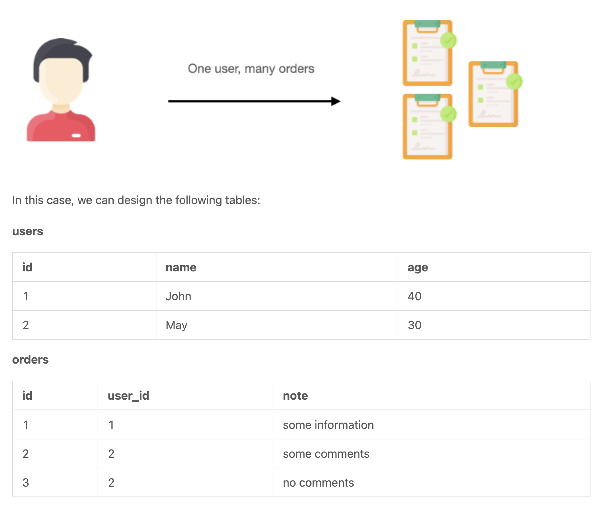
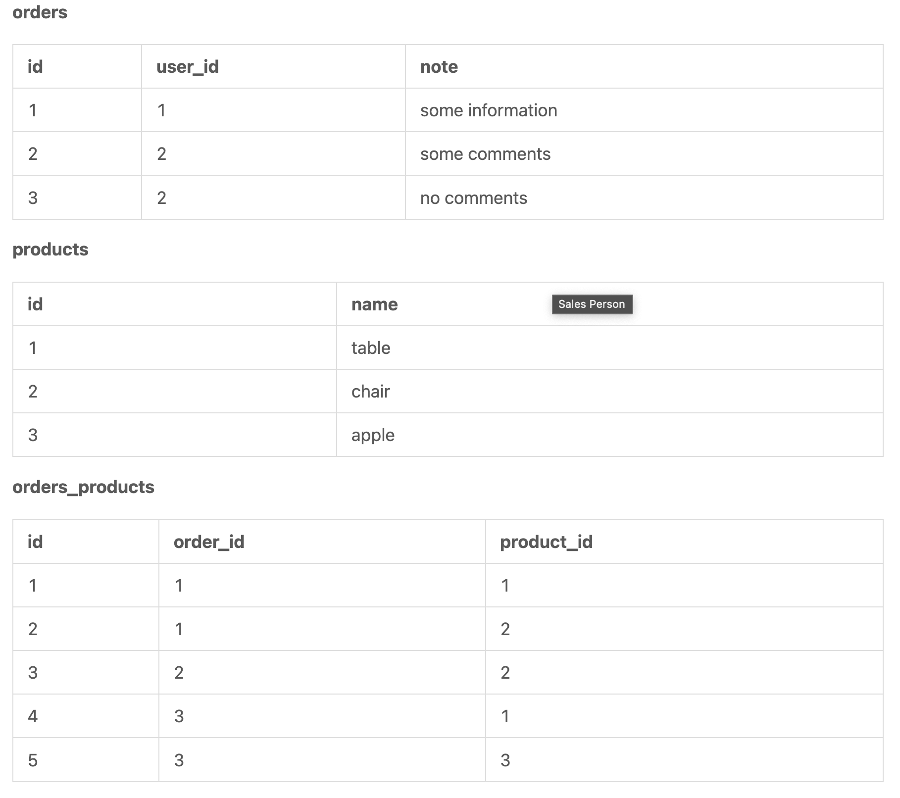
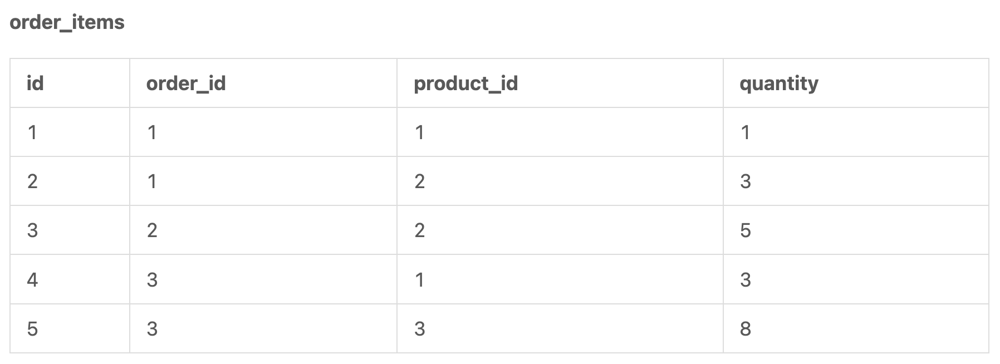
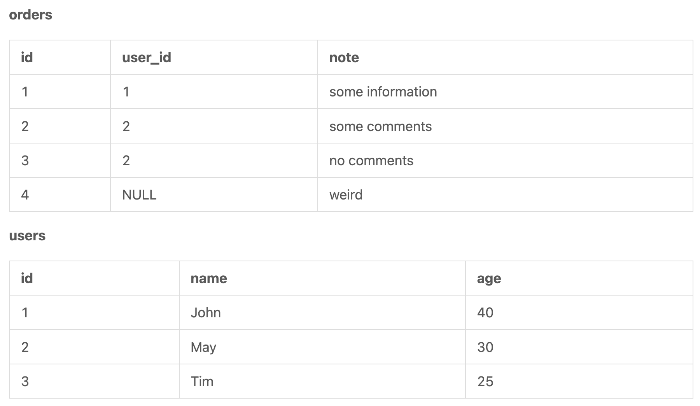
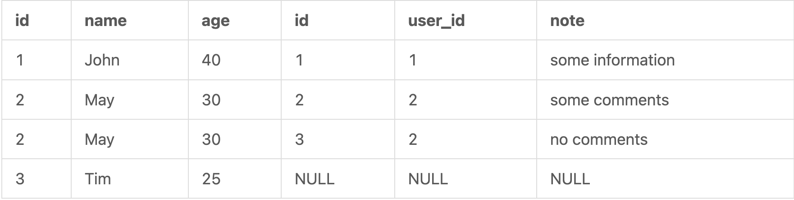
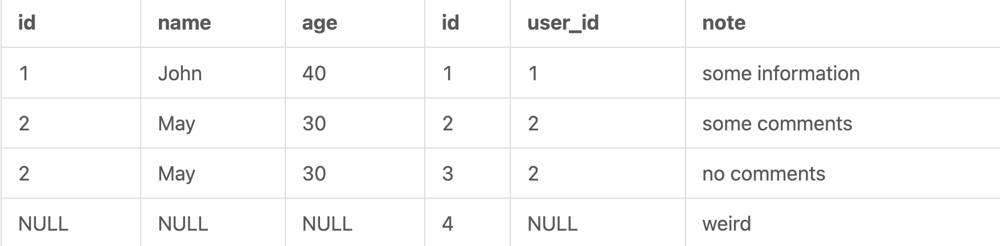
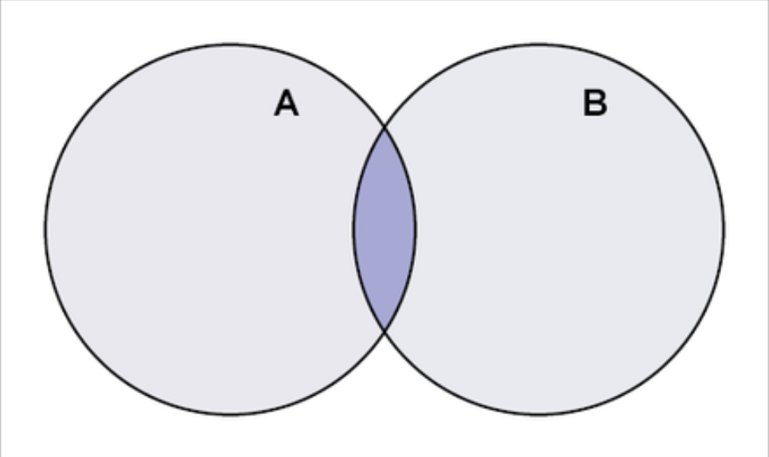
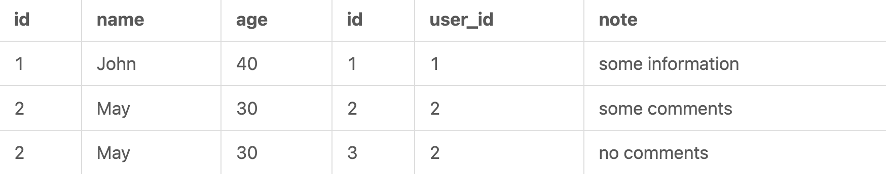

# 📍Relationships

## one to one




## one to many



## many to many

중간 테이블 생성이 필요




### meaningful transformation

중간테이블을 그냥 작성하지 말고, 의미가 있는 이름으로 변경하자.



# 📍Join

sample data

```sql
CREATE SCHEMA `new_schema` DEFAULT CHARACTER SET utf8mb4 COLLATE utf8mb4_unicode_ci;

CREATE TABLE `new_schema`.`users` (
  `id` INT NOT NULL AUTO_INCREMENT COMMENT 'This is the primary index',
  `name` VARCHAR(45) NOT NULL DEFAULT 'N/A',
  `age` INT NULL,
  PRIMARY KEY (`id`)
);

INSERT INTO `new_schema`.`users` (`id`, `name`, `age`) VALUES 
  (1, 'John', 40),
  (2, 'May', 30),
  (3, 'Tim', 25);
  
  
CREATE TABLE `new_schema`.`orders` (
  `id` INT NOT NULL AUTO_INCREMENT,
  `user_id` INT,
  `note` VARCHAR(255) NOT NULL,
  PRIMARY KEY (`id`)
);
 
INSERT INTO `new_schema`.`orders` (`id`, `user_id`, `note`) VALUES 
  (1, 1, 'some info'), 
  (2, 2, 'some comments'),
  (3, 2, 'no comments'),
  (4, NULL, 'weird');
```



## left join

왼쪽 테이블(드라이빙 테이블)에다가 오른쪽 테이블(드리븐 테이블)을 붙이는 것. 여기서 왼쪽은 from 뒤에 오는 테이블을 의미한다.

```sql
SELECT * FROM `new_schema`.`users`
LEFT JOIN `new_schema`.`orders` ON `users`.`id` = `orders`.`user_id`;
```

- users: 드라이빙 테이블, 왼쪽, 메인 테이블
- orders: 드리븐 테이블, 오른쪽, 메인 테이블 오른쪽에 붙는 테이블



왼쪽테이블 users를 기준으로 오른쪽에다가 orders테이블을 붙인다.

## right join

메인테이블(orders)에다가 왼쪽 테이블(users)를 붙인다.

```sql
SELECT * FROM `new_schema`.`users`
RIGHT JOIN `new_schema`.`orders` ON `users`.`id` = `orders`.`user_id`;
```



left join과 right join은 서로 반대이기 때문에, 지금 sql을 left join으로 바꾸면 동일한 의미가 된다.

```sql
SELECT * FROM `new_schema`.`orders`
LEFT JOIN `new_schema`.`users` ON `users`.`id` = `orders`.`user_id`;
```

## inner join



```sql
SELECT * FROM `new_schema`.`users`
INNER JOIN `new_schema`.`orders` ON `users`.`id` = `orders`.`user_id`;
```



## full outer join


[oracle full outer join](https://www.oracletutorial.com/oracle-basics/oracle-full-outer-join/)

```sql
SELECT
    select_list
FROM
    T1
FULL OUTER JOIN T2 ON join_condition;
```

# 📍Subquries

sample data

```sql
CREATE SCHEMA `new_schema` DEFAULT CHARACTER SET utf8mb4 COLLATE utf8mb4_unicode_ci;

CREATE TABLE `new_schema`.`users` (
  `id` INT NOT NULL AUTO_INCREMENT COMMENT 'This is the primary index',
  `name` VARCHAR(45) NOT NULL DEFAULT 'N/A',
  `age` INT NULL,
  PRIMARY KEY (`id`)
);

INSERT INTO `new_schema`.`users` (`id`, `name`, `age`) VALUES 
  (1, 'John', 40),
  (2, 'May', 30),
  (3, 'Tim', 22);
  
  
CREATE TABLE `new_schema`.`orders` (
  `id` INT NOT NULL AUTO_INCREMENT,
  `user_id` INT,
  `note` VARCHAR(255) NOT NULL,
  PRIMARY KEY (`id`)
);
 
INSERT INTO `new_schema`.`orders` (`id`, `user_id`, `note`) VALUES 
  (1, 1, 'some information'), 
  (2, 2, 'some comments'),
  (3, 2, 'no comments'),
  (4, 3, 'more comments');
```

## equal condition

```sql
SELECT * FROM `new_schema`.`orders`
WHERE user_id = (
  SELECT id FROM `new_schema`.`users`
  WHERE name = 'John'
);

-- 서브쿼리: 1개만 리턴
SELECT id FROM `new_schema`.`users` WHERE name = 'John';
```

## contain condition

```sql
SELECT * FROM `new_schema`.`orders`
WHERE user_id IN (
  SELECT id FROM `new_schema`.`users`
  WHERE name LIKE '%j%'
);

-- 서브쿼리: 여러개를 리턴
SELECT id FROM `new_schema`.`users` WHERE name LIKE '%j%';
```

## common mistake

### singluar and plural problem

```sql
SELECT * FROM `new_schema`.`orders`
WHERE user_id = (
  SELECT id FROM `new_schema`.`users`
  WHERE name LIKE '%j%'
);
```

like의 경우 여러개의 값을 가져올 수 있다. 따라서 오류가 난다. `=`가 아닌 `in`으로 바꿔주자. 

```sql
SELECT * FROM `new_schema`.`orders`
WHERE user_id IN (
  SELECT id FROM `new_schema`.`users`
  WHERE name LIKE '%j%'
);

```

### redundant columns in subqueries

`*`의 경우는 사용하지 말자. 필요한 쿼리가 아닌 모든 쿼리를 가지고 오면 에러가 발생할 수 있다.

```sql
SELECT * FROM `new_schema`.`orders`
WHERE user_id IN (
  SELECT * FROM `new_schema`.`users`
  WHERE name LIKE '%j%'
);
```