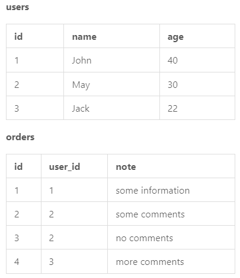
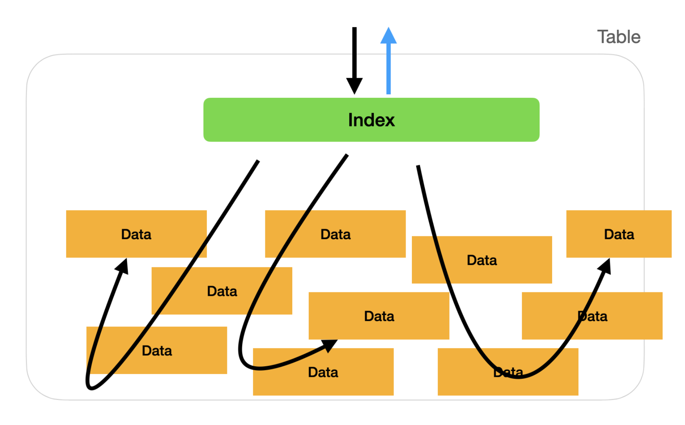

# 📍Foreign Key

외래키는 데이터를 바인딩하는 것이다.

실제 업무에서는 `constraints`를 활용한다. `constraints`를 설정하므로서 SQL에 자동체크와 데이터를 보호한다.

여기서 데이터 보안(data security)이란 만약 1명의 고객이 여러 주문 데이터를 가지고 있는 경우가 있다고 가정하자.

실수로 주문 데이터를 삭제하고, 나중에 해당 데이터를 찾는 경우에는 절대로 찾을 수 없다. 하지만 `foreign key`를 사용하면 해당 문제를 효과적이면서 자동으로 피할 수 있다.

sample data

```sql
CREATE SCHEMA `new_schema` DEFAULT CHARACTER SET utf8mb4 COLLATE utf8mb4_unicode_ci;

CREATE TABLE `new_schema`.`users` (
  `id` INT NOT NULL AUTO_INCREMENT COMMENT 'This is the primary index',
  `name` VARCHAR(45) NOT NULL DEFAULT 'N/A',
  `age` INT NULL,
  PRIMARY KEY (`id`)
);

INSERT INTO `new_schema`.`users` (`id`, `name`, `age`) VALUES 
  (1, 'John', 40),
  (2, 'May', 30),
  (3, 'Tim', 22);
  
  
CREATE TABLE `new_schema`.`orders` (
  `id` INT NOT NULL AUTO_INCREMENT,
  `user_id` INT,
  `note` VARCHAR(255) NOT NULL,
  PRIMARY KEY (`id`)
);
 
INSERT INTO `new_schema`.`orders` (`id`, `user_id`, `note`) VALUES 
  (1, 1, 'some information'), 
  (2, 2, 'some comments'),
  (3, 2, 'no comments'),
  (4, 3, 'more comments');
```



## basic syntax & usage

```sql
ALTER TABLE `new_schema`.`orders`
    ADD CONSTRAINT `orders_user_id_key`
    FOREIGN KEY (`user_id`)
    REFERENCES `new_schema`.`users` (`id`);
```

- `ALTER TABLE`: 어떤 테이블을 설정할지
- `ADD CONSTRAINT`: 제약조건을 설정하고 싶은 이름앞에 붙이는 것, 우리는 `orders_user_id_key`에 제약조건을 적용
- `FOREIGN KEY`: 우리가 바인딩하고 싶은 테이블의 foreign key
- `references`: 어떤 외부 테이블과 묶이게 만들것인지, 여기서는 users 테이블의 id에 적용

### protection from delete

위에와 같은 조건을 만들면, 삭제를 보호할 수 있다.

```sql
DELETE FROM `new_schema`.`users` WHERE (`id` = `1`);
```

```text
ERROR 1451: 1451: Cannot delete or update a parent row: a foreign key constraint fails.
```

다음과 같이 에러메세지가 나온 이유는 `orders` 테이블의 `user_id`와 연결이 되어있기 때문에 나왔다.

### protection from update

```sql
UPDATE `new_shema`.`users` SET `id` = `6` WHERE (`id` = `1`);
```

```text
ERROR 1451: 1451: Cannot delete or update a parent row: a foreign key constraint fails
```

이것 또한 동일한 이유에서 에러가 발생한다. 하지만 아래의 경우 작동한다.

```sql
UPDATE `new_shema`.`users` SET `name` = `Tony` WHERE (`id` = `1`);
UPDATE `new_shema`.`users` SET `user_id` = `3` WHERE (`id` = `1`);
```

왜냐하면 제약조건을 위반하지 않기 때문에 수행이 가능하다.

### remove a constraint

```sql
ALTER TABLE `new_schema`.`orders`
    DROP FOREIGN KEY `orders_user_id_key`;
```

## diverse constraints

제약 조건을 생성할 때 `mode`를 지정하지 않으면 디폴트 `no action`으로 된다. `no action`의 경우 `mysql`의 `restrict` 모드와 동일하다. 

이 경우일 때는 `update` 또는 `delete`의 경우 에러를 발생시킨다.

## syntax

```sql
ALTER TABLE `new_schema`.`orders`
    ADD CONSTRAINT `orders_user_id_key`
    FOREIGN KEY(`user_id`)
    REFERENCES `new_schema`.`users` (`id`)
    ON DELETE NO ACTION
    ON UPDATE RESTRICT;
```

- `ON DELETE NO ACTION`: users행이 삭제되어도 참조키를 가지고 있는 orders의 행은 사라지지 않는 것
- `ON UPDATE RESTRICTS`: orders가 참조하고 있는 users의 행이 변경이 있어도 orders 테이블의 행을 업데이트하지 못함.

## referential Actions

제약조건에서 `no action`과 `restrict`는 `referential actions`라고 부른다.

추가적으로 sql에서는 다른 2가지 모드를 제공한다.

- `cascade`: 만약 user의 id가 6으로 변경이 되었다면, 자동으로 orders테이블의 user_id가 6으로 변경이 되는 것.

- `set null`: 만약 user의 id가 6으로 변경이 되었다면, orders 테이블의 user_id는 null로 변경이 되는 것.

[mysql foreign key constraints manual](https://dev.mysql.com/doc/refman/8.0/en/create-table-foreign-keys.html)

# 📍Transaction

트랜젝션이란 SQL에서 데이터의 일관성을 지키는 것

`대부분의 Relational Database는 transaction을 지원하고, mongoDB 같은 비관계형 Database도 지원한다.`

[MongoDB transaction](https://www.mongodb.com/docs/manual/core/transactions/)

트랜젝션은 2가지 종류가 존재 1. `all success` 2. `all fail` 예시로는 은행 이체가 있음.

sample data

```sql
CREATE SCHEMA `new_schema` DEFAULT CHARACTER SET utf8mb4 COLLATE utf8mb4_unicode_ci;

CREATE TABLE `new_schema`.`products` (
  `id` INT NOT NULL AUTO_INCREMENT COMMENT 'This is the primary index',
  `title` VARCHAR(45) NOT NULL DEFAULT 'N/A',
  `price` INT NULL,
  PRIMARY KEY (`id`)
);

INSERT INTO `new_schema`.`products` (`id`, `price`, `title`) VALUES 
  (1, 10, 'chair'),
  (2, 100, 'desk'),
  (3, 200, 'bike'),
  (4, 200, 'motorcycle'),
  (5, 300, 'headphone'),
  (6, 300, 'phone');
```



## concept

트랜젝션이라는 `박스`에 여러 SQL statement를 넣고 실행하는 것. 1개의 chunk로 되는 것.

그 후에 나온 결과는 `store(저장)` or `restore(복구)`

## basic statement

```sql
--First Query
START TRANSACTION;

-- Second Queries
UPDATE `new_schema`.`products` SET `price` = '500' WHERE id = 5;
UPDATE `new_schema`.`products` SET `price` = '500' WHERE id = 6;

-- Third Query
COMMIT;
```

- `start transaction`: 트랜젝션의 시작
- `commit`: 저장

MySQL의 workbench의 경우, auto-commit mode(기본값)으로 되어있음.

이 의미는 MySQL을 작성할 때는 앞과 뒤에 작성한, `start transaction`과 `commit`을 사용할 필요가 없음.

[MySQL auto commit mode](https://dev.mysql.com/doc/refman/8.0/en/innodb-autocommit-commit-rollback.html)

## restore statement

만약 트랜젝션을 시작하고 쿼리를 실행하는 도중에 error가 발생하면 어떻게 될까

```sql
-- First Query
START TRANSACTION;

-- Second Queries
UPDATE `new_schema`.`products` SET `price` = '500' WHERE id = 5;
..
-- error happened here!
..
UPDATE `new_schema`.`products` SET `price` = '500' WHERE id = 6;

-- Third Query
ROLLBACK;
```

이 경우는 다름 query를 실행하지 않고, `rollback`으로 이동하게 됨.

이렇게 error가 발생함에 따라, rollback을 실행해서 데이터의 일관성을 유지할 수 있음.

트랜젝션의 경우, SQL뿐만 아니라 다른 기술언어에서도 제공이 된다.

- basic template

```sql
START TRANSACTION;

SELECT `new_schema`.`products` WHERE id = 5;
UPDATE `new_schema`.`products` SET `price` = '500' WHERE id = 5;

IF (@correct) THEN
  COMMIT;
ELSE
  ROLLBACK;
END IF;
```

- `sql control process`: [sql 제어 프로세스](https://dev.mysql.com/doc/refman/8.0/en/sql-compound-statements.html)
- `@correct`: [user defined variable](https://dev.mysql.com/doc/refman/8.0/en/user-variables.html)

# 📍ACID

ACID는 대부분의 데이터베이스 상에서 중요한 부분을 차지함.

각 데이터베이스의 성격에 따라서 다르겠지만, ACID를 기반으로 하는 것은 모두 동일함.

데이터 베이스에서 `distributed system deisgn problem(분산 시스템 설계)` 

ACID는 많은 도움을 준다. 따라서 ACID없이 `large traffic`을 해결하는 데이터베이스 설계는 매우 힘들다. 예를 들면 `high concurrency problem`(순간적으로 동시에 몰리는 문제)

## atomicity: the smallest unit

`여러 SQL statement가 있는 transaction은 1개의 query로 생각하자.` 왜냐하면 transaction의 query statement를 실행하는 도중 `error`가 발생하면 해당 transacion은 `rollback`하기 때문이다.

따라서 `atomicity`에 기반한 설계를 통해, SQL구문이 1 chunk로 이루어지도록 만들어줘야함.

`automicity`에 기반한 설계를 하지않으면, 대규모 트랜젝션에서 `crash event`가 발생하고 절반은 execute되고 절반은 execute되지 않는 일이 발생합니다.

### example

A계좌와 B계좌가 있음. 만약 데이터베이스가 `automicity`에 기반하지 않으면, A에서 돈을 인출 후, 이 부분까지가 1개의 transaction으로 됩니다. 따라서 A는 B에게 송금을 했지만 `B가 받는 로직의 transaction`이 묶여있지 않기 때문에, B는 A로부터 돈을 받지 못하게 됩니다.

## consistency: always make data consistent

`consistency`는 데이터의 일관성을 지키는 것입니다. transaction내에서 sql statement가 전부 성공해서 `commit`을 하거나 에러가 발생해서 `rollback`을 하는 것입니다.

이로써 데이터의 `일관성`를 지킬 수 있게 됩니다.

## isolation: transactions do not affect each other

`isolation`은 대규모 트래픽이 발생하거나 트래픽이 증가할 때 데이터에 발생하는 문제들을 해결할때 사용이 됩니다.

대규모 트래픽이 발생하거나 증가하면, 많은 record의 수정과 삭제가 이루어질 수 있습니다. 점차 복잡성이 올라가면서 `어떤 version이 올바른지 선택`해야하는 문제가 발생합니다.

따라서 `isolation`에 기반한 데이터베이스는 모든 transaction은 서로에게 영향을 주지 않는 것입니다.

[isolation level](https://en.wikipedia.org/wiki/Isolation_(database_systems)#Isolation_levels)

### example

public account A가 있습니다. A에 `송재근`과 `명재우`가 `동시에` 인출 또는 입금을 하게되는 경우 먼저 접근한 사람(송재근)에게 해당 `record`를 변경할 권리를 주고 외부에서 접근을 못하게 `lock`을 하게 됩니다.

그러면 `명재우`는 `queue`에서 기다리면서 `송재근`이 `unlock`될때까지 기다립니다.

```
Locked means the database prohibits any other transaction from modifying the locked record.
```

하지만 좋지않은 lock 메커니즘은 `deadlock`을 야기할 수 있습니다. -> [deadlock](https://docs.oracle.com/javadb/10.6.2.1/devguide/cdevconcepts28436.html)

## durability: always exist

`durability`는 `transaction`으로 부터 `commit`이 되면, 커밋결과가 영구적으로 저장이 되도록 SSD와 같은 hard disk에 저장하는 것입니다.

### example

만약 `durability`가 없다면, `commit` 이후에 하드디스크에 에러가 생겨 전원이 나간 경우, commit한 데이터는 하드디스크에서 찾을 수 없는 문제가 발생합니다.

# 📍Index

# 📍User Privilege